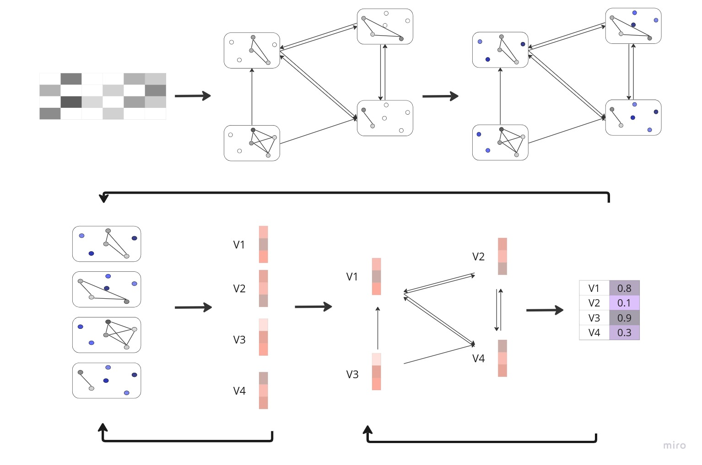

# SpaGoG
An implementation of "SpaGoG: Graph of Graphs to classify tabular data with large fractions of missing data".
SpaGoG (**Spa**rse data classification using **G**raph **o**f **G**raphs) is a model for classifying tabular data with large missing rates.
SpaGoG represents the tabular data as a graph of graphs and involves multiple graph-data classification techniques to classify the samples from different points of view.
This implementation is done with python 3.8 using PyTorch software.

<p align="center">
  
</p>

# How to use?

## Installation
SpaGoG source code is available as a PyPI package (see https://pypi.org/project/SpaGoG/):

```shell
pip install spagog
```

## Usage Example
Given train (both ```train_X```, ```test_y```) and test (at least ```test_X```) sets of type ```pandas.DataFrame```, SpaGoG can be executed, for example, using the following command:

```python
from spagog.main import gog_model

test_y = gog_model(train_X=train_X, train_Y=train_Y, test_X=test_X, model="gc", verbosity=1, to_numpy=False, evaluate_metrics=False)
```

## Argument List
Here are all the arguments accepted by ```spagog.main.gog_model```:

* _**model: str**_

The SpaGoG model to run. Options: [```"gc"```, ```"gnc"```, ```"gc+nc"```].
* _**train_X: pandas.DataFrame**_

The features of the training set.

* _**train_y: pandas.DataFrame**_

The labels of the training set.

* _**test_X: pandas.DataFrame**_

The features of the test set.

* _**test_y: pandas.DataFrame**_

The labels of the test set. If set to ```None```, the ```evaluate_metrics``` should be set to ```False```. Default: ```None```.

* _**val_X: pandas.DataFrame**_

The features of the validation set. If set to ```None```, it will be derived from the training set with 80:20 ratio. Default: ```None```.

* _**val_y: pandas.DataFrame**_

The labels of the validation set. Default: ```None```.

* _**evaluate_metrics: bool**_

Whether to evaluate and return the accuracy score on the data sets. If set to ```True```, the ```test_y``` argument must not be ```None```. Default: ```True```.

* _**dataset_name: str**_

The name of the data set to run, for a cleaner output text. Default: ```""```.

* _**feature_selection: int**_

Number of significant features to run the data on. The feature seslction process is executed only if ```1 <= feature_selection <= num_features```. Default: ```100```.

* _**edges: pandas.DataFrame**_

Edge list between the different samples (train, val and test), if there are any. If set to ```None```, the edeges are calculated as a K-Nearest-Neighbors graph. Default: ```None```.

* _**probs: bool**_

Whether to return soft labels for the test set predicrtions. Default: ```False```.

* _**to_numpy: bool**_

Whether to return the test set predicrtions as a ```numpy.array```. If set to ```False```, the predictions type will be ```torch.Tensor```. Default: ```False```.

* _**verbosity: int**_

Verbosity level of the running process. Set ```0``` for no output, ```1``` for evaluation metrics and timing report, and ```2``` to track the full learning process. Options: [```0```, ```1```, ```2```]. Defuault: ```0```.

